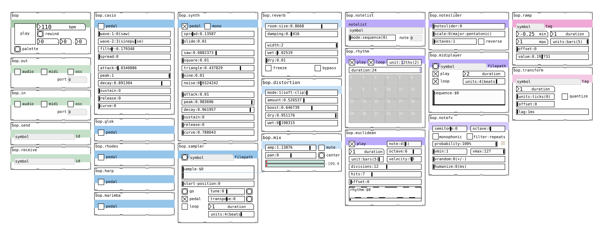

# bop 🐦
## for Pure Data

*bop* is a suite of modules for computer music composition in Pure Data.  It implements conventions of [Orac](https://github.com/TheTechnobear/Orac) with the aim of being somewhat cross compatible down the line, though more focussed on composition than performance.  Modules should provide an easy to use GUI and state saving to *"make shit easy"* 🐦. Currently it requires cyclone and freeverb.  Tested in Purr Data 2.17.  PD Vanilla(ish) compatibility incoming.

---

bop uses some fantastic abstractions from Mike Morenso's [pd-mkmr repository](https://github.com/MikeMorenoDSP/pd-mkmr).

